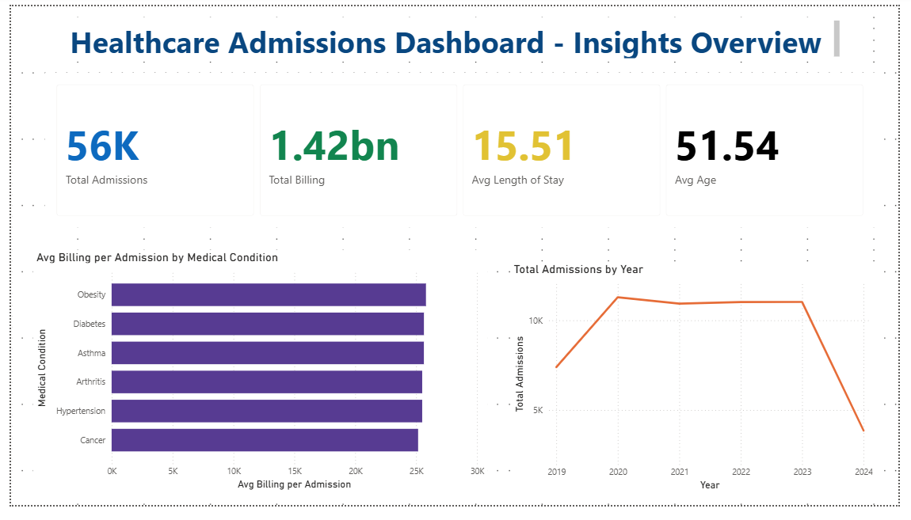
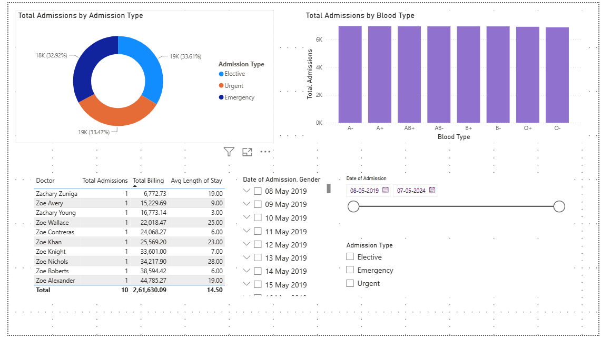

# Healthcare Admissions Dashboard (Power BI)

## Problem
Hospitals generate large volumes of admission, billing, and treatment data
that is difficult to interpret in raw form. This project analyzes hospital
admission records to surface trends in billing, admission type, and length
of stay, in order to support operational and financial reporting decisions.

## Data Source
Kaggle — Healthcare Dataset
https://www.kaggle.com/datasets/prasad22/healthcare-dataset

Note: this is a synthetically generated dataset used for practice purposes,
not real patient records.

## Process

### 1. Data Cleaning (Power Query)
- Added a unique `PatientID` index column (dataset had no primary key)
- Fixed data types (Date, Decimal, Whole Number, Text) across all columns
- Removed exact duplicate records to prevent double-counting in billing
  and admission metrics
- Standardized text casing (e.g., "BRandOn coLLINS" → "Brandon Collins")
  in Name and Doctor columns using Capitalize Each Word
- Checked and handled null/blank values in key columns (Billing Amount, Age)
- Added calculated columns: `Length of Stay` (Discharge Date − Date of
  Admission) and `Age Group` (binned age ranges)

### 2. Data Modeling
- Built a simple star schema: `Fact_Admissions` as the central fact table,
  with `Dim_Doctor` and `Dim_Insurance` as reference/dimension tables
- Established relationships between fact and dimension tables in Model view

### 3. DAX Measures
- `Total Billing`, `Total Admissions`, `Avg Length of Stay`, `Avg Age`
- `Avg Billing per Admission`
- `Emergency Rate` — share of admissions classified as Emergency
- `Abnormal Test Rate` — share of admissions with Abnormal test results

### 4. Dashboard
- KPI cards for headline metrics
- Bar chart: average billing by Medical Condition
- Line chart: admissions trend by month
- Donut chart: Admission Type breakdown
- Column chart: admissions by Blood Type
- Table: top doctors by total billing
- Interactive slicers: date range, gender, admission type

## Tools
Power BI Desktop, Power Query, DAX

## Screenshot

## Files in this repo
- `healthcare_dashboard.pbix` — full Power BI file
- `screenshot.png` — dashboard preview
- `README.md` — this file
